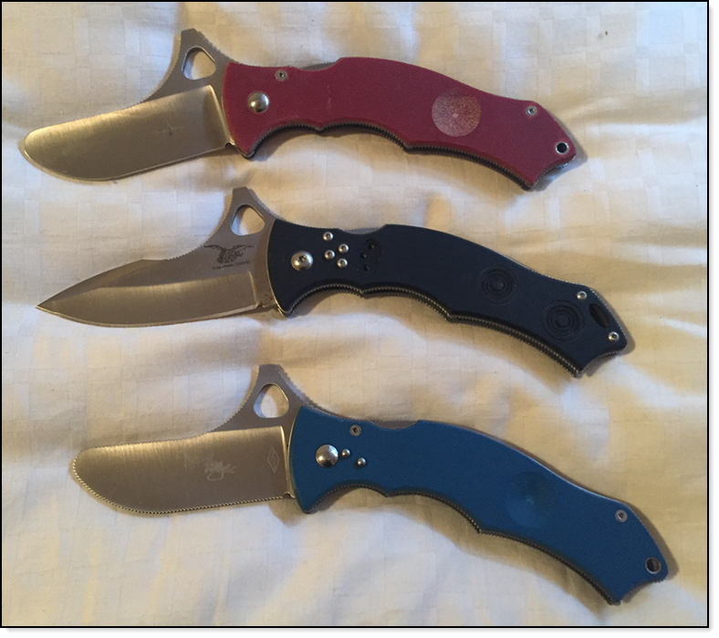
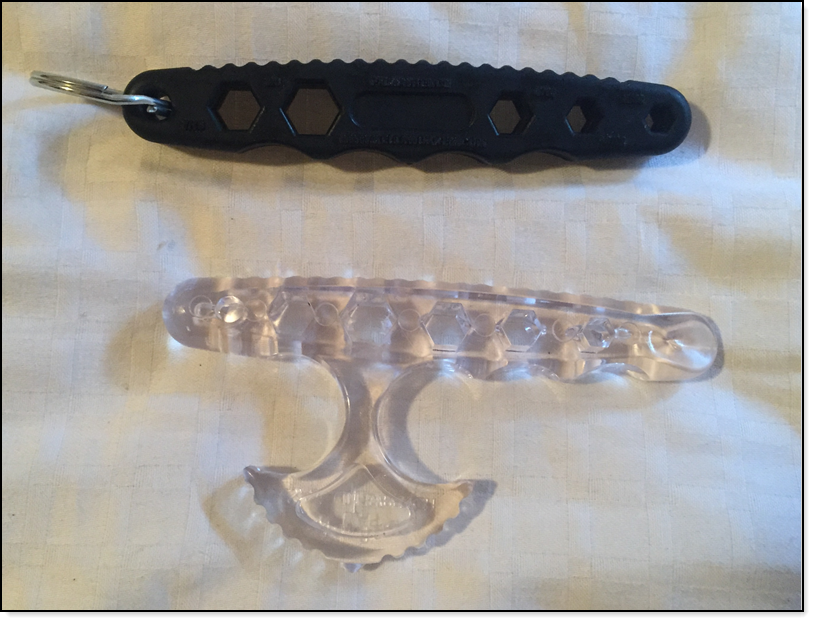

# Personal protection training

> Consider this post as food for thought when considering personal protection and is a work in progress.

Living in today’s world has become increasingly unsafe for the average citizen from various forms of crime that may lead to great injury of death. Many untrained people believe that the police will protect them while in most cases the police are there after the incident.

What others believe owning a firearm with or without a concealed handgun; license/permit is the key to protecting themselves and their love ones.  Although this sound like a decent plan here are several things to consider.

* As time passes it’s becoming difficult to obtain a personal protection firearm because of new and proposed legislation in our country.
* Without proper training, 
    * it is possible to have your firearm used against you. 
    * Or used in a manner, which breaks the law. This may lead to great injury, death, jail time.

**Fact** Criminals, especially ones that have been incarcerated training while doing time to hone their skills to attack you, this means you need to be prepared with proper training!!!

## Many times missed
* Proper training to gain time and distance to acquire the firearm along with when can the firearm be used. There are plenty of misguided information out there on the web. 
    *  Professional instructor rather than learning from a friend or family member.
    *  Having a firearm that fits properly in your hand
    *  Understanding how to properly carry, draw and when needed reholster
    *  Repetitive training from a professional instructor
    *  Intermediate and advance training which has many determining factors
    *  Learning local laws in regards to firearms along with local laws when travelling with a firearm.
* Empty hand tactics to get to one’s firearm or use empty hand tactics or simply work towards escaping ending with calling for help.
* Understanding [disparity of force](https://armedcitizensnetwork.org/images/stories/Network_2014-09.pdf) in the [force continuum](https://en.wikipedia.org/wiki/Use_of_force_continuum).
* Alternate means of protecting yourself and love ones.

# Firearm training

* if you are going to carry get training by a professional
* Practice, practice practice by repeating classes and regular training at a gun club.

## Pacific Northwest instuctors

* Oregon, [Jim jacobe](https://www.jimjacobe.com/)
* Washington State, [Firearms Academy of Seattle, Inc](https://firearmsacademy.com/)
* [Massad Ayoob](https://massadayoobgroup.com/), both of the above schools work with Massad.

# Learn empty hand tactics

Use of one's brain and empty hand tactics should be the base for personal protection and should not

* Be based on taking years of training. This is not to say you shouldn't but the average person doesn't have that much time to commit to training.
* Based on knowing hundreds of different techniques. Ask a good professional instructor and they will tell you that techniques need to be natural, reflective in nature. If told otherwise consider seeking out another instructor.

# Not everyone is equal

Being attacked by someone your size tends to be rare, typically an attacker is most likely larger than the intended victim.  This is taught by professional instructors plus they (when possible) will rotate different size students when in the class room training.

# We are tool users

The next level up from empty hand tactics, especially when dealing with the larger and aggressive attacker is to have a tool, which can assist with evening the odds. Keep in mind dependent on the tool be in non-lethal or not, one must still know the law and to what extent the tool can be used in the force continuum.

## Choices

* Pepper spray or mace, bad selection as one can contaminate themselves and may prove ineffective on some attackers
* Stun guns, mostly legal but not always and can be difficult to deploy, activate and hit the intended target. Also used in the wrong area of the body can lead to death when if the situation does not call for that level of foce may lead to incarceration.
* [Kubaton](https://en.wikipedia.org/wiki/Kubotan) which are great self defense tool. There are several variations, some with blunt ends while others have pointy ends. Going with this tool, stay away from the pointed ends as they can become unintended lethal force tool.

## Recommendations

There are two professional instructors, [Bram Frank](https://www.cssd-sc.com/bram-frank/) and [Kelly Worden](https://www.wordendefense.com/) who teach both empty hand and use of personal defense tools along with online training, books and DVD courses.

What sets both of these instructors apart from others is they both have tools that are extremely easy to learn and work with natural body mechanics.

Although the best form of training is taking a class, in today's climate this may prove difficult to impossible. On the bright side their tools can be learned by purchasing the tools coupled with purchasing their online or DVD courses. 

Learning can be done by yourself with a practice dummy or with a training partner. When training always keep your partner's safety foremost and never use a live tool at full force or when an edge tool is involved DO NOT use as there are countless people who thought it was safe and later on find themselves in the ER.

### Best tools

Both Kelly's and Bram's tools are by far the best tools to carry daily for self-defense. Easy to learn/use, have various options too carry e.g. I carry one of Bram's and Kelly's tools in either my bra or in my waistband. These tools can be carried on a belt or in the pocket.

* Important: Both Bram and Kelly offer trainers as one never should training with a live tool.

# Bram Frank tools

There are three main versions of these tools.

* Black, live blade, also for impact and control
* Blue, no edge, strictly for impact and control
* Red, a dedicated training for practicing impact and control (still hurts)

# Kelly Worden tools

Force multipliers; Travel wrench, palm wrench and Saf-T wrench. There is also a carry clip too.

