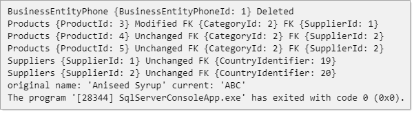
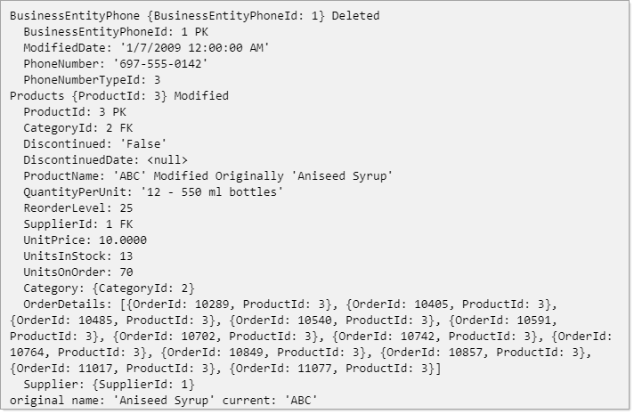

# Entity Framework Core Debug view


One of the nice features in EF Core 5 is ShortView and LongView from [DbContext.ChangeTracker.DebugView](https://docs.microsoft.com/en-us/dotnet/api/microsoft.entityframeworkcore.changetracking.changetracker.debugview?view=efcore-5.0)

Which permits a human-readable view of entities being tracked.

We can take this output and return only information which specific to what we want to view.

## Important
Before continuing, understand the code which follows may not work as expected if and when the views change from current implementation to a future implementation. Even if the implementation for the views change a developer can alter the code below to match new implementation of these views.

# Examples
These examples are based on the following [NorthWind](https://gist.github.com/karenpayneoregon/7a4ba781b7884be8aa88112260c154a4) database for SQL-Server, similarly using the Oracle version of [NorthWind](https://gist.github.com/karenpayneoregon/f3a6693dee67c528e5c4371f65675c9a) will work too.


# Change order date, required date and shipped date

In most NorthWind databases, dates are before 2000. So we want to change the dates to the current century.

Create a reference dictionary

```csharp
/// <summary>
/// Reference table for replacing years in the three date columns/properties
/// </summary>
private static Dictionary<int, int> YearsReplaceDictionary => new()
{
    [1990] = 2000,
    [1991] = 2001,
    [1992] = 2002,
    [1993] = 2003,
    [1994] = 2004,
    [1995] = 2005,
    [1996] = 2006,
    [1998] = 2008,
    [1999] = 2009
};
```

Get orders

```csharp
await using var context = new NorthwindContext();
var orderList = await context.Orders.ToListAsync();
```

Iterate in a `for` statement, here just RequiredDate is shown

```csharp
if (orderList[index].RequiredDate.HasValue)
{

    if (YearsReplaceDictionary.ContainsKey(orderList[index].RequiredDate.Value.Year))
    {

        var currentRequiredDate = orderList[index].RequiredDate.Value;

        var newRequiredDate = new DateTime(
            YearsReplaceDictionary[orderList[index].RequiredDate.Value.Year],
            currentRequiredDate.Month,
            currentRequiredDate.Day);

        orderList[index].RequiredDate = newRequiredDate;

    }
}
```

Outside of the for statement we use an extension method to view changes

```csharp
Debug.WriteLine(context.ChangeTracker.DebugView.OrdersDatesOnlyView());
```

Which is an easy to read view and notice one year is not being updated, 1997. So we see the code looks good then notice there is no key in the dictionary for 1997 and add it.

```csharp
private static Dictionary<int, int> YearsReplaceDictionary => new()
{
    [1990] = 2000,
    [1991] = 2001,
    [1992] = 2002,
    [1993] = 2003,
    [1994] = 2004,
    [1995] = 2005,
    [1996] = 2006,
    [1997] = 2007,
    [1998] = 2008,
    [1999] = 2009
};
```

Or we could avoid a missing year with the following. 

If this is used make sure other developers on your team understand this code.

```csharp
Dictionary<int, int> YearsReplaceDictionary = Enumerable.Range(1990, 10)
    .Select(index => new
    {
        Old = index,
        New = index + 10
    })
    .ToDictionary(item => item.Old, item => item.New);
```    


Run the code again and all is good, we can now save changes.

```csharp
await context.SaveChangesAsync();
```

Now we could also write a query with a data provider to get a count of the years and compare against the return value of SaveChangesAsync for validation too. The advantage of a view be it ShortView, LongView or custom view is we can visually inspect the data.

Here is the extension used above.

```csharp
public static string OrdersDatesOnlyView(this DebugView sender)
{
    var longViewLines = sender.LongView
        .Split(new[] { Environment.NewLine }, StringSplitOptions.None);

    StringBuilder builder = new();

    foreach (var line in longViewLines)
    {
        if (line.Contains("OrderId", StringComparison.OrdinalIgnoreCase) || 
            line.Contains("Date", StringComparison.OrdinalIgnoreCase))
        {
            builder.AppendLine(line);
        }
    }

    return builder.ToString();

}
```

Then if we need one for Customer operations we create another extension

```csharp
public static string CustomerNameChangeView(this DebugView sender)
{
    var longViewLines = sender
        .LongView.Split(new[] { Environment.NewLine }, StringSplitOptions.None);

    StringBuilder builder = new();
    string[] tokens = { "CustomerId", "was", "CompanyName" };

    foreach (var line in longViewLines)
    {

        if ( line.Has(tokens))
        {
            builder.AppendLine(line);
        }
        
    }

    return builder.ToString();

}
```


Both will work while they are hard-wired to specific words/tokens. Let's try going with a version which accepts words/tokens.

```csharp
public static string CustomView(this DebugView sender, string[] tokens)
{
    var longViewLines = sender
        .LongView.Split(new[] { Environment.NewLine }, StringSplitOptions.None);

    StringBuilder builder = new();

    foreach (var line in longViewLines)
    {

        if (line.Has(tokens))
        {
            builder.AppendLine(line);
        }

    }

    return builder.ToString();

}
```


How about providing words/tokens to find and words/tokens to ignore? These two will do this along with providing the ability to chunk data. Chunking is done by getting a property count for a model and add 1.

```csharp
public static string CustomViewByChunks(this DebugView sender, string[] includeTokens, string[] excludeTokens, int chunkSize)
{
    var longViewLinesList = sender
        .LongView.Split(new[] { Environment.NewLine }, StringSplitOptions.None)
        .ToList();

    var chunks = longViewLinesList.ChunkBy(chunkSize);

    StringBuilder builder = new();

    foreach (var chunk in chunks)
    {
        foreach (var item in chunk)
        {
            if (item.Has(includeTokens) && !item.Has(excludeTokens))
            {
                builder.AppendLine(item);
            }
        }
    }

    return builder.ToString();
}
public static string CustomViewByChunks(this DebugView sender, string[] includeTokens, int chunkSize)
{
    var longViewLinesList = sender
        .LongView.Split(new[] { Environment.NewLine }, StringSplitOptions.None)
        .ToList();

    var chunks = longViewLinesList.ChunkBy(chunkSize);

    StringBuilder builder = new();

    foreach (var chunk in chunks)
    {
        foreach (var item in chunk)
        {
            if (item.Has(includeTokens))
            {
                builder.AppendLine(item);
            }
        }
    }

    return builder.ToString();
}
```

## ShortView



## LongView




# DebugView extensions

``` csharp
using System;
using System.IO;
using System.Linq;
using System.Text;
using Microsoft.EntityFrameworkCore.Infrastructure;

namespace YourNamespace.LanguageExtensions
{
    /// <summary>
    /// Extension methods for assisting in both learning EF Core and debugging.
    /// </summary>
    public static class DebugViewExtensions
    {

        /// <summary>
        /// Provides a slimmed down view for dates and primary key
        /// </summary>
        /// <param name="sender"><seealso cref="DebugView"/> enabled to track changes</param>
        /// <returns>original and current values</returns>
        public static string OrdersDatesOnlyView(this DebugView sender)
        {
            var longViewLines = sender.LongView
                .Split(new[] { Environment.NewLine }, StringSplitOptions.None);

            StringBuilder builder = new();

            foreach (var line in longViewLines)
            {
                if (line.Contains("OrderId", StringComparison.OrdinalIgnoreCase) || 
                    line.Contains("Date", StringComparison.OrdinalIgnoreCase))
                {
                    builder.AppendLine(line);
                }
            }

            return builder.ToString();

        }

        /// <summary>
        /// Write <see cref="OrdersDatesOnlyView"/> to file
        /// </summary>
        /// <param name="sender"><seealso cref="DebugView"/> enabled to track changes</param>
        /// <param name="fileName">path and file name to write to.
        /// Recommend writing to a folder that the developer has create permissions too.</param>
        /// <remarks>
        /// Void of error-handling as this is designed for developer mode,
        /// if used in test or prod then add exception handling for assertions
        /// on fail to write which most likely is lack of permissions to a folder.
        /// </remarks>
        public static void OrdersDatesOnlyViewToFile(this DebugView sender, string fileName)
        {
            File.WriteAllText(fileName, sender.OrdersDatesOnlyView());
        }

        /// <summary>
        /// Display only details we are interested in for a <see cref="Customer"/>
        /// </summary>
        /// <param name="sender"><seealso cref="DebugView"/> enabled to track changes</param>
        /// <returns></returns>
        public static string CustomerNameChangeView(this DebugView sender)
        {
            var longViewLines = sender
                .LongView.Split(new[] { Environment.NewLine }, StringSplitOptions.None);

            StringBuilder builder = new();
            string[] tokens = { "CustomerId", "was", "CompanyName" };

            foreach (var line in longViewLines)
            {

                if ( line.Has(tokens))
                {
                    builder.AppendLine(line);
                }
                
            }

            return builder.ToString();

        }

        /// <summary>
        /// Used to focus LongView to specific parts of the resulting string
        /// </summary>
        /// <param name="sender"><seealso cref="DebugView"/> enabled to track changes</param>
        /// <param name="tokens">one or more strings to locate in the view</param>
        /// <returns>tailor LongView</returns>
        public static string CustomView(this DebugView sender, string[] tokens)
        {
            var longViewLines = sender
                .LongView.Split(new[] { Environment.NewLine }, StringSplitOptions.None);

            StringBuilder builder = new();

            foreach (var line in longViewLines)
            {

                if (line.Has(tokens))
                {
                    builder.AppendLine(line);
                }

            }

            return builder.ToString();

        }

        public static string CustomView(this DebugView sender, string[] tokens, int? lineCount)
        {
            var longViewLines = sender
                .LongView.Split(new[] { Environment.NewLine }, StringSplitOptions.None);

            StringBuilder builder = new();
            if (lineCount.HasValue)
            {
                var result = longViewLines.Where(x => x.Has(tokens)).Take(lineCount.Value).ToArray();
                foreach (var line in result)
                {
                    builder.AppendLine(line.Contains("Unchanged", StringComparison.OrdinalIgnoreCase) ? 
                        "" : 
                        line.TrimStart());
                }
            }

            return builder.ToString();


        }

        public static string CustomViewByChunks(this DebugView sender, string[] includeTokens, string[] excludeTokens, int chunkSize)
        {
            var longViewLinesList = sender
                .LongView.Split(new[] { Environment.NewLine }, StringSplitOptions.None)
                .ToList();

            var chunks = longViewLinesList.ChunkBy(chunkSize);

            StringBuilder builder = new();

            foreach (var chunk in chunks)
            {
                foreach (var item in chunk)
                {
                    if (item.Has(includeTokens) && !item.Has(excludeTokens))
                    {
                        builder.AppendLine(item);
                    }
                }
            }
   
            return builder.ToString();
        }
        public static string CustomViewByChunks(this DebugView sender, string[] includeTokens, int chunkSize)
        {
            var longViewLinesList = sender
                .LongView.Split(new[] { Environment.NewLine }, StringSplitOptions.None)
                .ToList();

            var chunks = longViewLinesList.ChunkBy(chunkSize);

            StringBuilder builder = new();

            foreach (var chunk in chunks)
            {
                foreach (var item in chunk)
                {
                    if (item.Has(includeTokens))
                    {
                        builder.AppendLine(item);
                    }
                }
            }

            return builder.ToString();
        }

        /// <summary>
        /// Direct custom view to a text file
        /// </summary>
        /// <param name="sender"><seealso cref="DebugView"/> enabled to track changes</param>
        /// <param name="tokens">one or more strings to locate in the view</param>
        /// <param name="fileName">path and file name to write to.
        /// Recommend writing to a folder that the developer has create permissions too.</param>
        /// <remarks>
        /// Void of error-handling as this is designed for developer mode,
        /// if used in test or prod then add exception handling for assertions
        /// on fail to write which most likely is lack of permissions to a folder.
        /// </remarks>
        public static void ToFile(this DebugView sender, string[] tokens,string fileName)
        {
            File.WriteAllText(fileName, sender.CustomView(tokens));
        }
    }
}
```


# Language extensions for custom views

```csharp
public static class ListExtensions
{
    public static bool Has(this string sender, string[] items)
    {
        foreach (var item in items)
        {
            if (sender.Contains(item, StringComparison.OrdinalIgnoreCase))
            {
                return true;
            }
        }

        return false;

    }
    public static List<List<T>> ChunkBy<T>(this List<T> source, int chunkSize)
        => source
            .Select((value, index) => new { Index = index, Value = value })
            .GroupBy(x => x.Index / chunkSize)
            .Select(grp => grp.Select(v => v.Value).ToList())
            .ToList();
}
```