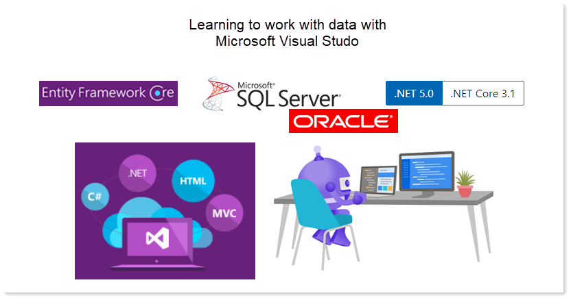

# Internal Visual Studio training update

- Course material is broken down into steps averaging two hours each know as modules.
  - Module 1 – Validate each developer has all required software installed and working
    - Talk on how training will work
      - Safe environment for everyone
      - There are no dummy questions.
      - Mentoring
      - Not everyone learns at the same pace
      - Indicate this is a hands-on
      - Source code will be available as needed and after each module
      - Indicate any time a break is needed they will be taken
      - Provide resources
        - Online documentation
        - Internal resources
      - If course work runs over for a lesson adjust accordingly
    - Discuss the IDE
    - Git (source control)
      - Ensure each developer can access our GitHub repository
      - Have each attendee create personal repositories
    - Create a simple Console project &quot;Hello World&quot;
      - Use their personal Git repository to manage the project
  - Module 2 – Learn structure of a Visual Studio project
    - Provide pre-done code samples mirroring Cold Fusion code
      - Pull source from GitHub
      - Run code
    - Namespaces, projects, classes
    - Common layout of a solution for consistency in all projects
    - Basics of unit test
    - Learn about statements and relate to Cold Fusion
      - Write code via unit test