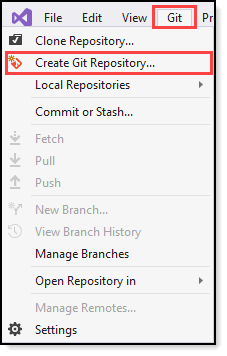
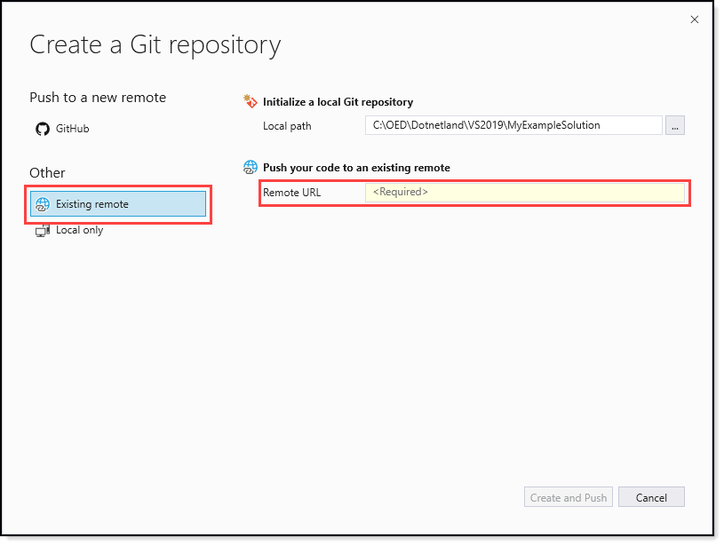

# Signing up for a new GitHub account

First you need to setup an account which is free.

- While creating your repository on GitHub make it public, not private.
- Later, under `setting`, `Danger zone` you can remove the repository or simple change visibility to private.

:heavy_check_mark: Use [instructions here](https://docs.github.com/en/github/getting-started-with-github/signing-up-for-a-new-github-account).

:heavy_check_mark: [Verify your email address](https://docs.github.com/en/github/getting-started-with-github/verifying-your-email-address).

# Git experience in Visual Studio

:heavy_check_mark:  [How to use Git in Visual Studio](https://docs.microsoft.com/en-us/visualstudio/ide/git-with-visual-studio?view=vs-2019)

# Use Git in Visual Studio

- First off, create a new GitHub repository giving the repository a useful but short name e.g. `Working-with-images`.
- In Visual Studio, open the solution
- Select `Git` Menu (see figure 1)
- A dialog appears, select `existing repository`
- Paste in the URL from your newly created repository on GitHub.
- Click the button `Create and Push`
- Go back to the repository on GitHub, refresh the page to ensure everything was pushed.
- Provide the link in a post.

**Figure 1**

**Figure 2**

