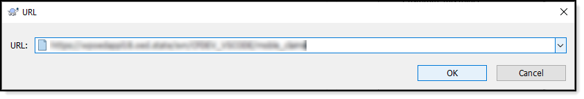
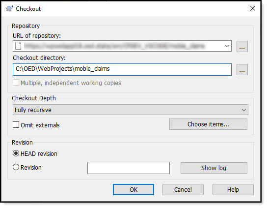

# Tortoise from Windows Explorer

:house: [Home page](https://tinyurl.com/y68k2g97)

Setup a repository from SVN, using mobile claims as an example.

**Notes** 
- To try this out see Karen or Bill and ask for the address to mobile claims under CFDEV_VSCODE
- The path used e.g. C:\OED\WebProjects is a suggestion
- The path under C:\OED\WebProjects\mobile_claims is a suggestion

## Instructions
- Select a folder e.g. C:\OED\WebProjects
- Right click 
- Select Tortoise [see figure 1](#Figure-1)
- Select Repo-Browser
- Enter address for mobile claims [see figure 2](#Figure-2)
- Sign-in with Windows credentials
- Right click
- Select Checkout
- Ensure URL address is correct
- Ensure Checkout directory is set [see figure 3](#Figure-3)
- Click OK
- Project is then checkout

In VS Code
- File menu
- Open folder
- Traverse to C:\OED\WebProjects
- Single click mobile_claims

At this point SVN is setup and ready to use although unless Tortoise extension is setup/configured correctly, <kbd>Ctrl</kbd> + <kbd>S</kbd> will not copy a file to the development server.

### Figure-1

### Figure-2
(address is blured on purpose, ask another developer for the proper address)

### Figure-3

