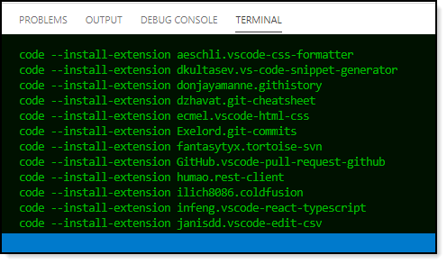

# About

:radio_button: To validate the VS Code installation.

- Press <kbd>Ctrl</kbd> + <kbd>,</kbd>
-  When the setting window appears
-  Type tort. Then validate there is a path for “Tortoise SVN: Tortoise SVNProc Exe Path” as shown in figure 1.
    - If you don’t see this then Tortoise is not installed, :x: **STOP** :x: here and notify me.
    - If you see the setting but does not show C:\Program Files\TortoiseSVN\bin\Tortoise.exe, :x: **STOP** :x: here and notify me.
    - If you do see C:\Program Files\TortoiseSVN\bin\Tortoise.exe :heavy_check_mark: **this is right**.

:radio_button: Next up, make sure these are installed.
- https://marketplace.visualstudio.com/items?itemName=ilich8086.ColdFusion
- https://marketplace.visualstudio.com/items?itemName=liximomo.remotefs
- https://marketplace.visualstudio.com/items?itemName=liximomo.sftp
- https://marketplace.visualstudio.com/items?itemName=johnstoncode.svn-scm
- https://marketplace.visualstudio.com/items?itemName=fantasytyx.tortoise-svn (this one is from above steps)

:radio_button: How to know what extensions are installed as per above.

- Open VS Code
- At the bottom of the screen set focus to the Terminal window and paste in the following
  - code --list-extensions | % { "code --install-extension $_" } >InstalledExtensions.txt
  - This will write installed extensions to a file in the current folder remove >InstalledExtensions.txt to see the list in the terminate window (see figure 2)

### Figure 1

### Figure 2

