# Basic editing

[Read the following from Microsoft](https://code.visualstudio.com/docs/editor/codebasics)

# Standard keyboard shortcuts

Since VS Code shortcuts are different from Aptana, it is best to review keyboard shortcuts. If the shortcuts are not likeable press <kbd>Ctrl</kbd> + <kbd>K</kbd> + <kbd>S</kbd> to open a window showing shortcuts. 

Suppose a line needs to be deleted, what’s the shortcut? After pressing CTRL+K,S type in delete to filter. Note the shortcut <kbd>Ctrl</kbd> + <kbd>Shift</kbd> + <kbd>K</kbd>. To change, hover over the line highlighted a pencil appears on the far left, single click to bring a dialog up prompting for a new shortcut, here <kbd>Ctrl</kbd> + <kbd>D</kbd> was entered. Note it’s already used, to override press <kbd>enter</kbd> or to abort click outside the dialog.

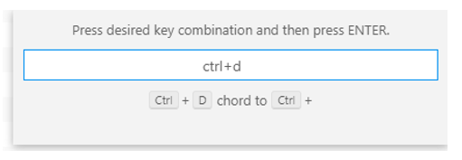

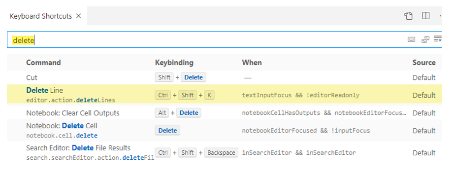

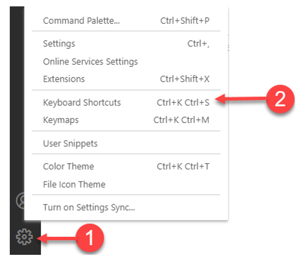

# Opening a source file

From the explorer pane single click a file and the file is now open and shown in “OPEN EDITORS”.

# IntelliSense/auto-complete

https://code.visualstudio.com/docs/editor/intellisense

Unlike Aptana VS Code does not require a < to start, simple start typing e.g. to use cffunction type cff and we see

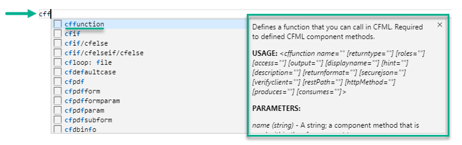

Pressing <kbd>enter</kbd> expands to a cffunction

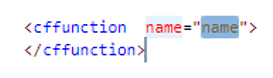

Note name is selected, type in the function name. Since cffunction has parameters and the Cold Fusion extension does not offer parameters a code snippet can be created, the screenshot below shows one Karen Payne made.

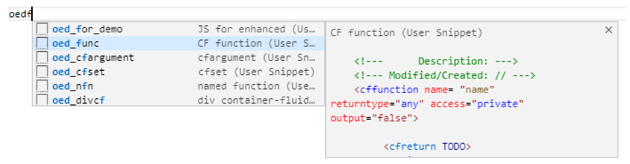

A header is placed above the function and the cursor is on name, type a name, press TAB which opens a selection for returntype, select one, press TAB, a selection appears for access, select one, press TAB and selection is offered on output. Press TAB and the cursor moves to the function body.

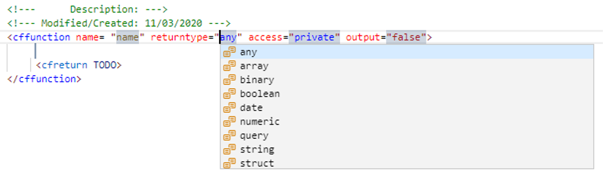

# Sample/useful snippets

Are located under S:\APPLICATIONS\WebTeam\KarenPayne\VS Code\snippets 

To add snippets to VS Code 

The following is displayed, select a language. Note the choices where snippets have global or project scope. Always select the proper extension and do not use project scope unless the code is specific to only one project.

Common to our work are highlighted and shown in recent list which will not happen until used at least once.

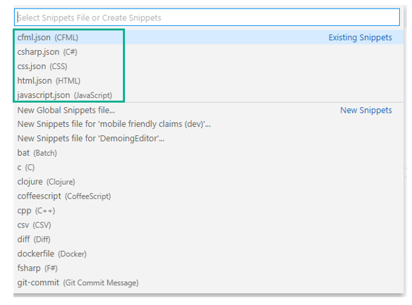

Once the file is open copy code from one pre-done and paste in followed by saving the file. At this point they are ready to go.

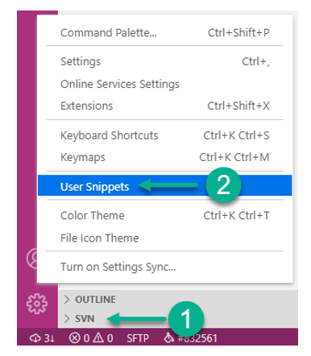

# Navigating code

File can be opened from the WORKSPACE pane or if a file is open in a workspace and another file needs to be open.

**Breadcrumbs** is shown as shown below

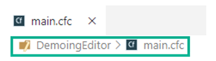

In the above cast DemoingEditor is a workspace and main.cfc is a file in this workspace, click on main.cfc and all files are shown (not many in this case).

Select one to open it.

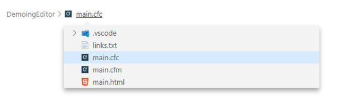

Since this workspace has multiple projects click on DemoingEditor will provide a listing of all files.

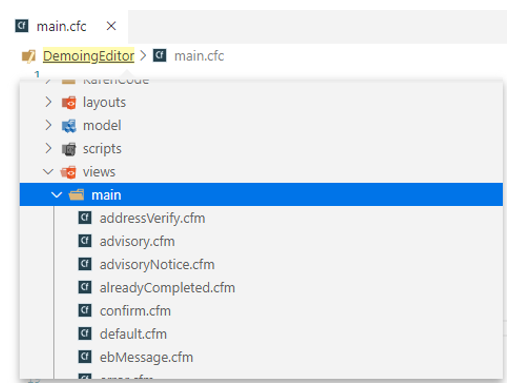

# Collapse code

 Hover to the right of a line number, click the down arrow to Collapse

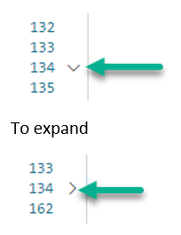

# Move a line

Move line down <kbd>Alt</kbd> + <kbd>Down</kbd>, move line up <kbd>Alt</kbd> + <kbd>Up</kbd>.

# Multi-cursor and column selection mode

When in column select mode pressing and holding the <kbd>Alt</kbd> key then using <kbd>Up</kbd>/<kbd>Down</kbd> arrow keys allow column selection. There is a side effect, afterwards moving away from a selection there will be more than one cursor, press <kbd>Esc</kbd> to exit multi cursor. For more on multi cursor see the following [documentation](https://code.visualstudio.com/docs/editor/codebasics#_multiple-selections-multicursor). See the following [documentation](https://code.visualstudio.com/docs/editor/codebasics#_column-selection-mode) for column select mode.

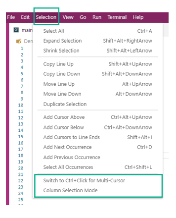