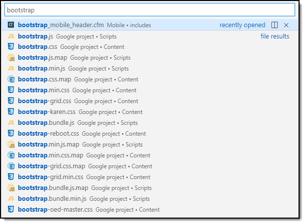
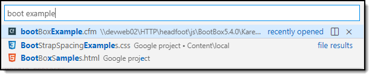
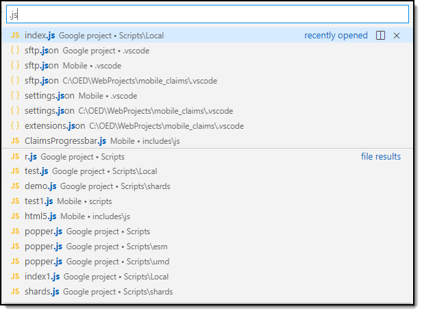
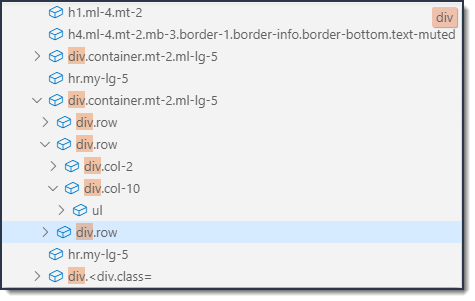
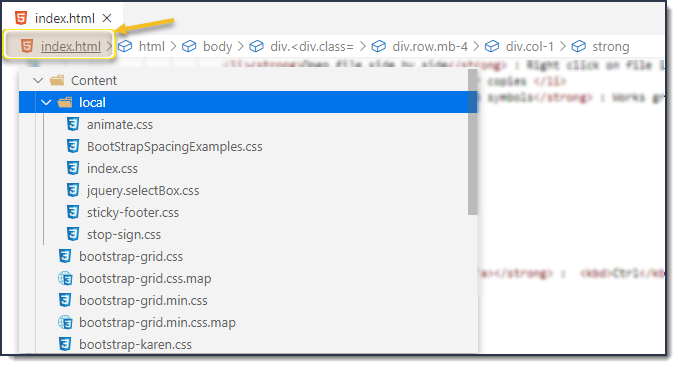

# Quick tip shortcuts

:house: [Home page](https://tinyurl.com/y68k2g97)

- Open a project from Total Commander, traverse to the code, select DOS from the command menu. At the command prompt type <strong>code .</strong> and press <kbd>enter</kbd> to open the project in VS Code
- <kbd>Ctrl</kbd> + <kbd>Shift</kbd> + <kbd>P</kbd> or <kbd>F1</kbd> is the life blood. Once invoked, start typing command e.g. <strong>cf</strong> and commands like Cold Fusion toggle comments is shown with it's shortcut or type SVN for SVN commands etc.
- <kbd>Ctrl</kbd> + <kbd>,</kbd> to open settings where there is an input which you can type in something like <strong>wrap</strong> to get all wrap settings.
- <kbd>Ctrl</kbd> + <kbd>`</kbd> to open the terminal window which accepts commands like for svn or git
- Many of the items in the bottom statusbar will activate settings or provide useful feedback
- Color themes can be [workspace](https://code.visualstudio.com/docs/getstarted/settings) independent
- <kbd>Ctrl</kbd> + <kbd>K</kbd> + <kbd>S</kbd> opens keyboard shortcuts. Don't care for a shortcut, hover over the item, select the pencil icon on the left to change it
- Exensions can be enabled/disabled globally or just for a workspace
- Open the currently opened file side by side <kbd>Ctrl</kbd> + <kbd>\\</kbd> and each window has their own current positions
- <kbd>Ctrl</kbd> + <kbd>Shift</kbd> + <kbd>E</kbd> in an editor to change to the explorer window (this toggles between explorer and editor)
- Join lines: you have muliple line to fold into one line, highlight lines, <kbd>Ctrl</kbd> + <kbd>Shift</kbd> + <kbd>P</kbd> or <kbd>F1</kbd> type ,<strong>join lines</strong> <kbd>enter</kbd>
- Copy lines up/down <kbd>Shits</kbd> + <kbd>Alt</kbd> + <kbd>&#8593;</kbd> or <kbd>&#8595;</kbd>
- Move line up or down <kbd>Alt</kbd> + <kbd>&#8593;</kbd> or <kbd>&#8595;</kbd>

- <kbd>Ctrl</kbd> + <kbd>P</kbd> Start typing <strong>goto symbol</strong> show list of symbols, blah not in Cold Fusion, try it in JavaScript
- <kbd>Ctrl</kbd> + <kbd>P</kbd> Start typing part of a file name [see figure 1](#Figure-1)
- <kbd>Ctrl</kbd> + <kbd>P</kbd> Type parts of file name for fuzzy [see figure 2](#Figure-2)
- <kbd>Ctrl</kbd> + <kbd>P</kbd> Type as done above, highlight file, press <kbd>Right arrow</kbd> to open file. Repeat till done, last item press <kbd>ENTER</kbd>
- <kbd>Ctrl</kbd> + <kbd>P</kbd> Type file extension [see figure 3](#Figure-3)
- <kbd>Ctrl</kbd> + <kbd>P</kbd> Type as any of the above, press <kbd>Ctrl</kbd> then click to open file to the side of the current open file
- <kbd>Ctrl</kbd> + <kbd>G</kbd> Go to line, negative number like -1 goes to last line
- <kbd>Ctrl</kbd> + <kbd>G</kbd> Go to line-column, Row<kbd>:</kbd>Column
- <kbd>Ctrl</kbd> + <kbd>G</kbd> Type full file name then <kbd>:</kbd> then a line number press <kbd>ENTER</kbd> which opens to that line
- <kbd>Ctrl</kbd> + <kbd>G</kbd> Go to <strong>Last edit location</strong> take you back to the last place an edit was made.
- **Open file side by side** : Right click on file in file explorer, select **Open to side**. Do this multiple times, navigate in each and the cursor position is independent of other copies

- Open file side by side : Right click on file in file explorer, select <strong>Open to side</strong>. Do is multiple times, navigate in each and the cursor position is independent of other copies</i>
- Working with symbols> : Works great if not Cold Fusion. Plenty of features when working say with vaScript.
- [Breadcrumbs](#Figure-5) : <kbd>Ctrl</kbd> + <kbd>Shift</kbd> + <kbd>.</kbd> window opens, to filter art typing
- [Breadcrumbs](#Figure-6) : Navigate to other files</li>
- <a href="https://github.com/viatsko/awesome-vscode">awesome-vscode</a> list of extensions for vs code (not all, a select zen or so)
- <a href="https://www.vscodecandothat.com/">VS Code can do that?!</a>

### Figure-1

### Figure-2

### Figure-3

### Figure-4

### Figure-5

### Figure-6

