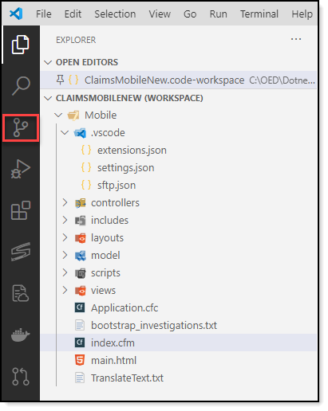
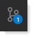
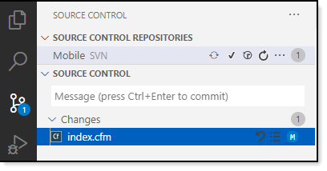
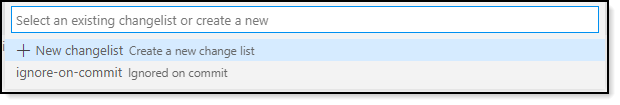
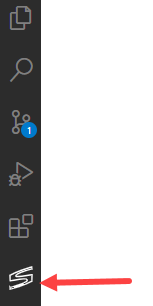
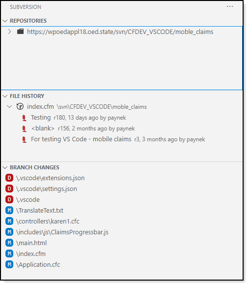
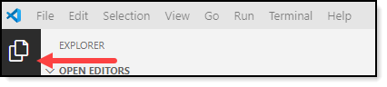
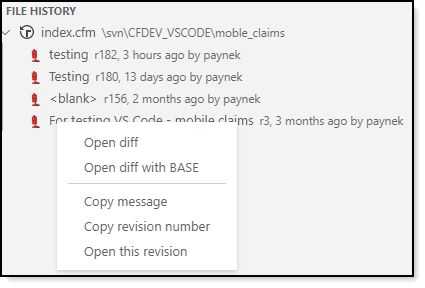

# Working with SVN

[Home page](https://tinyurl.com/y68k2g97)

To access SVN, click on the icon below.

When a change is made to a source code file and saved via <kbd>Ctrl</kbd> + <kbd>S</kbd> a blue circle will appear with the number of files ready to be committed.

Click on the icon and the following appears

- Enter a commit message, press <kbd>Ctrl</kbd> + <kbd>Enter</kbd> a commit message (or click on the clock icon for prior commit messages)
- For additional options click <kbd>...</kbd> directly above the comment input

**Notes**
- Single click a file to see the diff.
- Right click a file for additional options
- Click on the bullet list to the right of a file name for more options

# Sub version icon

Provides the following.

By double clicking a file from the editor explorer

Then selecting the sub version icon, double click a line under **FILE HISTORY** to do a comparision between current and an older version of the selected file.

Right click on a file for more options.

