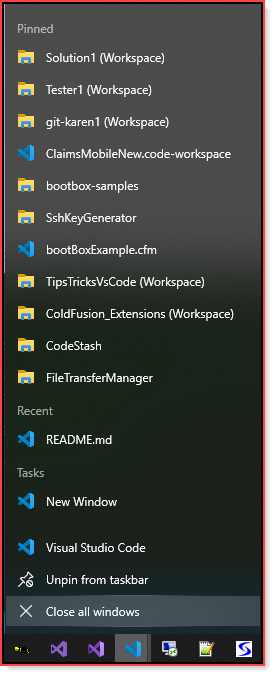

# Starting VS Code recommendation

Locate the location of VS Code 

**Default location**

C:\Users\\**login_name**\AppData\Local\Programs\Microsoft VS Code

- Right click on Code.exe
- Pin to task bar

Open a project, now it's in the recent list. Close VS Code, select the VS Code icon in the task bar, while holding the mouse slide up. Find a project to remember, right click and pin it.

Example

