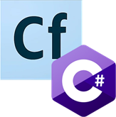
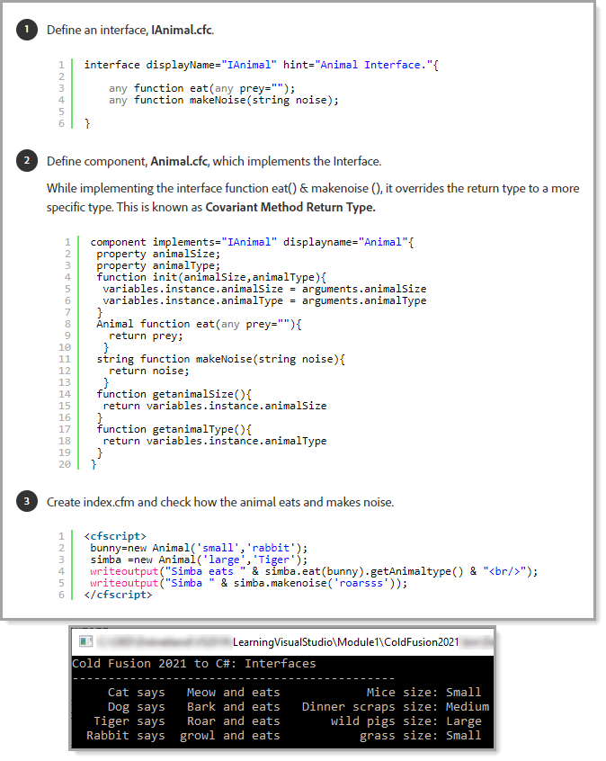

# Give students something familar 




For part of Visual Studio training I looked at some of the OOP in Cold Fusion 2021 as relating to what a student/developer are comfortable with is paramount as most developers are seasoned Cold Fusion developers.

This allows students to have a warm feeling as they see something familar.

:heavy_check_mark: Not surprised most code samples are not tag based but script based.

:heavy_check_mark: Took a look at Interfaces as in C# Interfaces are used often.

Question, how would the following be done in C#?


In [this page](https://helpx.adobe.com/coldfusion/developing-applications/building-blocks-of-coldfusion-applications/object-oriented-programming-coldfusion.html) above mention Abstract components and methods which C# does and goes deeper but let's keep it simple.

---

## C# code 

**Size** would be an enumeration

```csharp
public enum Size {

    Small,
    Medium,
    Large
}
```

**Interface**

```csharp
interface IAnimal
{
    /// <summary>
    /// Animal name
    /// </summary>
    public string Name { get; set; }
    /// <summary>
    /// Size of animal
    /// </summary>
    public Size Size { get; set; }
    public string Eats { get; set; }
    /// <summary>
    /// Sound of animal
    /// </summary>
    /// <returns></returns>
    string MakeNoise();
}
```
Implement `Interface` for several animal types

```csharp
public class Dog : IAnimal
{
    public string Name { get; set; }
    public Size Size { get; set; }
    public string Eats { get; set; }
    public string MakeNoise() => "Bark";
}
public class Cat : IAnimal
{
    public string Name { get; set; }
    public Size Size { get; set; }
    public string Eats { get; set; }
    public string MakeNoise() => "Meow";
}
public class Rabbit : IAnimal
{
    public string Name { get; set; }
    public Size Size { get; set; }
    public string Eats { get; set; }
    public string MakeNoise() => "growl";
}
public class Tiger : IAnimal
{
    public string Name { get; set; }
    public Size Size { get; set; }
    public string Eats { get; set; }
    public string MakeNoise() => "Roar";
}
```

Create a `list of animals` then `iterate` each one and show details

```csharp
using System;
using System.Collections.Generic;
using System.Xml.Schema;
using ColdFusion2021.Interfaces;

namespace ColdFusion2021
{
    class Program
    {
        static void Main(string[] args)
        {
            Console.WriteLine("Cold Fusion 2021 to C#: Interfaces");
            
            Console.WriteLine(new string('-',45));
            
            List<IAnimal> animals = new()
            {
                new Cat()
                {
                    Name = "Fluffy",
                    Size = Size.Small, 
                    Eats = "Mice"
                }, 
                new Dog()
                {
                    Name = "Doggie",
                    Size = Size.Medium, 
                    Eats = "Dinner scraps"
                }, 
                new Tiger()
                {
                    Name = "Tigger",
                    Size = Size.Large, 
                    Eats = "wild pigs"
                }, 
                new Rabbit()
                {
                    Name = "Thumper.",
                    Size = Size.Small, 
                    Eats = "grass"
                }
            };

            foreach (var animal in animals)
            {
                Console.WriteLine($"{animal.GetType().Clean(),8} says {MakeNoise(animal),6} and eats {animal.Eats,15} size: {animal.Size}");
            }


            Console.ReadLine();
        }

        static string MakeNoise(IAnimal animal) => animal switch
        {
            Cat => animal.MakeNoise(),
            Dog => animal.MakeNoise(),
            Tiger => animal.MakeNoise(),
            Rabbit => animal.MakeNoise(),
            _ => ""
        };
        
    }
}

```

A little helper

```csharp
using System;
using System.Reflection;

namespace ColdFusion2021
{
    public static class Extensions
    {
        public static string Clean(this Type sender) => 
            $"{sender.ToString().Replace(Assembly.GetExecutingAssembly().GetName().Name! + ".Interfaces.", "")}";
    }
}
```





