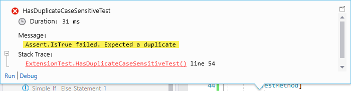
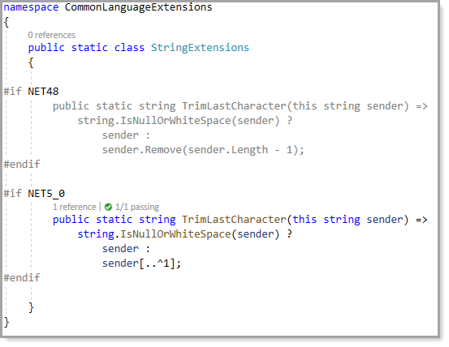
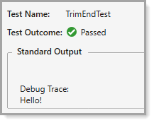

# Developers are also detectives

<table>
    <tr>
        <td width="135"></td>
        <td style="vertical-align:top">
            Novice developers many times when they don’t know how to accomplish a task will ask how can this be done in one of the many developer forums, get a solution, drop in the solution into code and if the solution works continue their work.<br><br>
            One of the problems with simply dropping code in is that without proper testing this code can produce undesirable results or overly complex.
        </td>
    </tr>
</table>

<br>


Perfect example, creating a SQL statement by concatenation of various properties of an object while this may work until an apostrophe turns up. Then the developer ends up using string replace to double up on apostrophes, which can work while making code hard to maintain. Some will realize using parameters to a command object is not such a bad idea. Of course if this were Entity Framework this is handled for them while the point is not fully testing a given solution, not using or not using parameters.

Another example, a developer wants to remove the last character in a string e.g. given “Hello!”. They are given the following.

```csharp
public static class StringExtensions
{
    public static string TrimLastCharacter(this string sender)
    {
        return string.IsNullOrWhiteSpace(sender) ? 
            sender : 
            sender.TrimEnd(sender[sender.Length - 1]);
    }
}
```

Or with C# 8

```csharp
public static class StringExtensions
{

    public static string TrimLastCharacter(this string sender) =>
        string.IsNullOrWhiteSpace(sender) ?
            sender :
            sender.TrimEnd(sender[^1]);
}
```

Test the code and the `!` is removed. There is a problem which would not be known without understanding [TrimEnd](https://docs.microsoft.com/en-us/dotnet/api/system.string.trimend?view=net-5.0) or taking time to read Microsoft docs. Here the second usage produces `Hello`. 

```csharp
string greetings = "Hello!";
Debug.WriteLine(greetings.TrimLastCharacter());
greetings = "Hello!!!";
Debug.WriteLine(greetings.TrimLastCharacter());
```

While taking time to read Microsoft docs would reveal why this happens. If developers take time to read docs then the following is a solution.

```csharp
public static class StringExtensions
{

    public static string TrimLastCharacter(this string sender) => 
        string.IsNullOrWhiteSpace(sender) ? 
            sender : 
            sender.Remove(sender.Length - 1);

}
```

And when using `C# 8`, less code and easy to understand.

The `..` is called the "range operator". `^1` is a shortcut for `sender.length - 1`.

```csharp
public static class StringExtensions
{
    public static string TrimLastCharacter(this string sender) =>
        string.IsNullOrWhiteSpace(sender) ?
            sender :
            sender[..^1];
}
```

Another example where the task is to determine if there are duplicate elements in a **List&lt;string&gt;**. The following code is found

```csharp
public static bool ContainsIgnoreCase(this string source, string substring) =>
    source?.IndexOf(substring ?? "", StringComparison.OrdinalIgnoreCase) >= 0;
 ```

Code is placed into a class

```csharp
namespace CommonLanguageExtensions
{
    public static class StringExtensions
    {

        public static bool ContainsIgnoreCase(this string source, string substring) =>
            source?.IndexOf(substring ?? "", StringComparison.OrdinalIgnoreCase) >= 0;

        public static string ToYesNoString(this bool value) => value ? "Yes" : "No";            
        
    }
}
```


Then a unit test is written

```csharp
[TestMethod]
public void HasDuplicateTest()
{
    List<string> listValues = new()
    {
        "E-10-XN-PP",
        "E - 10 - XN - MM",
        "E - 10 - XN - MM"
    };

    Debug.WriteLine(listValues.HasDuplications().ToYesNoString());

    listValues.RemoveAt(1);

    Debug.WriteLine(listValues.HasDuplications().ToYesNoString());
}

```

Run the test and it works as expected yet there is an issue, do you see it? The issue is case sensitivity.

In this test the issue surfaces

```csharp
[TestMethod]
public void HasDuplicateCaseSensitiveTest()
{
    List<string> listValues = new()
    {
        "E-10-XN-PP",
        "E - 10 - XN - mm",
        "E - 10 - XN - MM"
    };

    Debug.WriteLine(listValues.HasDuplications().ToYesNoString());
}
```

Note that for this who are wondering where the assertions are we surely can while the intent was to have a visual so for those familary with unit test.

```csharp
[TestMethod]
public void HasDuplicateCaseSensitiveTest()
{
    List<string> listValues = new()
    {
        "E-10-XN-PP",
        "E - 10 - XN - mm",
        "E - 10 - XN - MM"
    };

    Assert.IsTrue(listValues.HasDuplications(),
        "Expected a duplicate");

}
```




To fix the case sensitivity

```csharp
public static bool HasDuplicationsIgnoreCase(this List<string> sender) =>
    sender.GroupBy(value => value.ToLower()).Any(@group => @group.Count() > 1);
```    

Test it.

```csharp
[TestMethod]
public void HasDuplicateCaseSensitiveTest()
{
    List<string> listValues = new()
    {
        "E-10-XN-PP",
        "E - 10 - XN - mm",
        "E - 10 - XN - MM"
    };

    Assert.IsTrue(listValues.HasDuplicationsIgnoreCase(),
        "Expected a duplicate");

}
```


# Unit test

Keeping with the thought process mentioned above, understanding the basics, in this case working with strings there is one final thing. Write unit test against a solution with variations which validate code works under various conditions e.g. `Hello!` and `Hello!!`, does the code still work with an empty string?

In the event code needs to run on more than one version of the .NET Framework setup code with [conditional compile](https://docs.microsoft.com/en-us/dotnet/standard/frameworks#how-to-specify-target-frameworks).

```csharp
using System;

namespace CommonLanguageExtensions
{
    public static class StringExtensions
    {

#if NET48
        public static string TrimLastCharacter(this string sender) => 
            string.IsNullOrWhiteSpace(sender) ? 
                sender : 
                sender.Remove(sender.Length - 1);
#endif 
        
#if NET5_0
        public static string TrimLastCharacter(this string sender) =>
            string.IsNullOrWhiteSpace(sender) ?
                sender :
                sender[..^1];
#endif
        
    }
}

```

Which shows up as follows, greyed out indicates the code will not be used.




Then unit test

```chsharp
[TestClass]
public class ExtensionTest
{
    [TestMethod]
    public void TrimEndTest()
    {
        string greetings = "Hello!!";
        Debug.WriteLine(greetings.TrimLastCharacter());
    }
}
```

As shown in results, only one explanation has been removed which is exactly the outcome intended.



# Summary

:heavy_check_mark: Take time to understand code given.

:heavy_check_mark: Learn basics e.g. what does a method do?

:heavy_check_mark: Validate with test rather in application code.

:x: Don't simply drop solutions into code without testing.

</br>

# References

- [String class](https://docs.microsoft.com/en-us/dotnet/api/system.string?view=net-5.0)
- [Indices and ranges](https://docs.microsoft.com/en-us/dotnet/csharp/whats-new/tutorials/ranges-indexes)
- [Create and run unit tests for managed code](https://docs.microsoft.com/en-us/visualstudio/test/walkthrough-creating-and-running-unit-tests-for-managed-code?view=vs-2019)
- [Extension Methods](https://docs.microsoft.com/en-us/dotnet/csharp/programming-guide/classes-and-structs/extension-methods)

---

