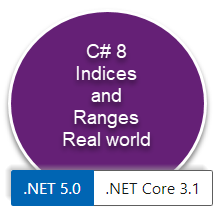

# About

Working with obtaining a range from a list.




When responded to a forum question about finding string elements between two elements I provided a simple solution then afterwards decided to do a quick writing on going from simple to a version which handles assertions on method parameters and use Indices and Ranges which are features released with C#8.

Sharing code like this can assist with other developer's growth, especially from developers not working in a team that ask questions in forums while nine times out of ten they plug in the code with no regard to is it the proper solution. Then we have those who take time to study code, ask questions and learn.

Although this is not an indepth guide on using Indices and Ranges for the intermediate to advance developer they will get it, use or not use but will usually when not use tuck the code away.

:bulb: Need a decent way to quickly stash code, see 

Microsoft TechNet article [Visual Studio Code stash with VS-Code](https://social.technet.microsoft.com/wiki/contents/articles/54244.visual-studio-code-stash-with-vs-code.aspx).

</br>

---

**Their list**

```csharp
List<string> periods = new List<string>
{
    "2010 Fya",
    "2011 FYA",
    "2012 FYA",
    "2013 FYA",
    "1Q 2014A",
    "2Q 2014A",
    "3Q 2014A",
    "4Q 2014A",
    "2014 FYA"
};
```

**My solution**, Code to run

```csharp
var result = periods.BetweenItems("2010 FYA", "3Q 2014A");
if (result is not null)
{
    foreach (var item in result)
    {
        Debug.WriteLine(item);
    }
}
else
{
    Debug.WriteLine("Start or end value not located");
}
```

**Posted for the above** using List&lt;T> [GetRange](https://docs.microsoft.com/en-us/dotnet/api/system.collections.generic.list-1.getrange?view=net-5.0) as the core code.

```csharp
 public static class Extensions
 {
     public static List<string> BetweenItems(this List<string> sender, string startValue, string endValue)
     {
         var startIndex = sender.IndexOf(startValue);
         var endIndex = sender.IndexOf(endValue) - startIndex +1;
    
         return startIndex == -1 || endIndex == -1 ? null : sender.GetRange(startIndex, endIndex);
     }
 }
 ```

 Then considered case insensitive option using [StringComparison.OrdinalIgnoreCase](https://docs.microsoft.com/en-us/dotnet/api/system.stringcomparer.ordinalignorecase?view=net-5.0).

 ```csharp
 public static class Extensions
{
    /// <summary>
    /// Produces an array where the first element is startValue, last element is endValue with all values between both case insensitive.
    /// </summary>
    /// <param name="sender">List of <see cref="string"/></param>
    /// <param name="startValue">first element to start the range</param>
    /// <param name="endValue">last element to end the range</param>
    /// <returns>range between startValue and endValue or null if neither start or end values do not exist in sender array</returns>
    public static List<string> BetweenItems(this List<string> sender, string startValue, string endValue)
    {

        var startIndex = sender.FindIndex(element => 
            element.Equals(startValue, StringComparison.OrdinalIgnoreCase));
        
        var endIndex = sender.FindIndex(element => 
            element.Equals(endValue, StringComparison.OrdinalIgnoreCase)) - startIndex + 1;

        return startIndex == -1 || endIndex == -1 ? null : sender.GetRange(startIndex, endIndex);
        
    }

}

```

These work while not fool-proof e.g.

- No assertion on method parameters which should
    -  Check for null parameter values
    - If both start and end elements exists in the list

This then evolved into the following which uses [Indices and Range](https://docs.microsoft.com/en-us/dotnet/csharp/whats-new/csharp-8#indices-and-ranges) rather then GetRange.    


### Scenarios for indices and ranges

[From Microsoft](https://docs.microsoft.com/en-us/dotnet/csharp/whats-new/tutorials/ranges-indexes)

<table>
    <tr>
        <td>
        You'll often use ranges and indices when you want to analyze a portion of a larger sequence. The new syntax is clearer in reading exactly what portion of the sequence is involved. 
        </td>
    <tr?>
</table>

```csharp
using System;
using System.Collections.Generic;
using System.Diagnostics.CodeAnalysis;
using System.Linq;
using System.Text;
using System.Threading.Tasks;

namespace Ranges_examples.Classes
{
public class Helpers
{
    /// <summary>
    /// Get elements between two elements 
    /// </summary>
    /// <param name="sender">string array</param>
    /// <param name="startItem">start element</param>
    /// <param name="endItem">end element</param>
    /// <returns>Range between start and end items or null</returns>
    public static string[] GetBetweenInclusive(string[] sender, [DisallowNull] string startItem, [DisallowNull] string endItem)
    {
        /*
        * Note this statement uses an anonymous type as there is no need to expose this outside of the current method
        */
        var elementsList = sender.Select((element, index) => new 
        {
            Name = element, 
            StartIndex = new Index(index), 
            EndIndex = new Index(Enumerable.Range(0, sender.Length).Reverse().ToList()[index], true)
        }).ToList();

        var start = elementsList.FirstOrDefault(item => item.Name == startItem);
        var end = elementsList.FirstOrDefault(item => item.Name == endItem);

        return start is null || end is null ? null : sender[start.StartIndex..end.EndIndex];
    }
}

```
Results for case insensitive method

```txt
2010 Fya
2011 FYA
2012 FYA
2013 FYA
1Q 2014A
2Q 2014A
3Q 2014A
```

# Summary

There are usually options to select from and when there are it's up to the developer to decide which best fits their task, not based on old or new but what best fits along with considerations for performance.


