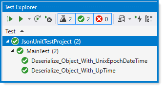

# System.Text.Json date support


[Microsoft docs](https://docs.microsoft.com/en-us/dotnet/standard/datetime/system-text-json-support)

The [System.Text.Json](https://docs.microsoft.com/en-us/dotnet/api/system.text.json?view=net-5.0) library parses and writes [DateTime](https://docs.microsoft.com/en-us/dotnet/api/system.datetime?view=net-5.0) and [DateTimeOffset](https://docs.microsoft.com/en-us/dotnet/api/system.datetimeoffset?view=net-5.0) values according to the ISO 8601-1:2019 extended profile. [Converters](https://docs.microsoft.com/en-us/dotnet/api/system.text.json.serialization.jsonconverter-1?view=net-5.0) provide custom support for serializing and deserializing with JsonSerializer. Custom support can also be implemented when using [Utf8JsonReader](https://docs.microsoft.com/en-us/dotnet/api/system.text.json.utf8jsonreader?view=net-5.0) and [Utf8JsonWriter](https://docs.microsoft.com/en-us/dotnet/api/system.text.json.utf8jsonwriter?view=net-5.0).


## Using Unix epoch date format

The following [converter](https://docs.microsoft.com/en-us/dotnet/standard/datetime/system-text-json-support#using-unix-epoch-date-format) works well except for comparing with local time. To work with local time, see the following slightly modified [converter](https://github.com/karenpayneoregon/power-shell-process-cs/blob/master/PowerShellLibrary/Converters/UnixEpochLocalDateTimeConverter.cs#L19).


# Testing

The following uses PowerShell to get local time along with several other date times.

See [DeserializeObjectUnixEpochDateTime](https://github.com/karenpayneoregon/power-shell-process-cs/blob/master/PowerShellLibrary/Classes/JSonHelper.cs#L27) for use of converter

```csharp
public class Operations
{
    public static async Task<DateContainer> GetPartialComputerInformationTask(string fileName)
    {

        var start = new ProcessStartInfo
        {
            FileName = "powershell.exe",
            RedirectStandardOutput = true,
            Arguments = "Get-ComputerInfo | select BiosReleaseDate,OsLocalDateTime,OsLastBootUpTime,OsUptime | ConvertTo-Json",
            CreateNoWindow = true
        };

        using var process = Process.Start(start);
        using var reader = process.StandardOutput;

        process.EnableRaisingEvents = true;

        var fileContents = await reader.ReadToEndAsync();

        await File.WriteAllTextAsync(fileName, fileContents);
        await process.WaitForExitAsync();

        var json = await File.ReadAllTextAsync(fileName);

        return JSonHelper.DeserializeObjectUnixEpochDateTime<DateContainer>(json);

    }
}
```
Results from running 

```csharp
[TestMethod]
[TestTraits(Trait.UnixEpochDateTime)]
public async Task Deserialize_Object_With_UnixEpochDateTime()
{
    var cdi = await Operations.GetPartialComputerInformationTask("computerDateInfo.json");

    var today = new DateTime(
        cdi.OsLocalDateTime.Year, 
        cdi.OsLocalDateTime.Month,
        cdi.OsLocalDateTime.Day, 
        cdi.OsLocalDateTime.Hour,
        cdi.OsLocalDateTime.Minute,
        0);

    var result = DateTime.Compare(
        cdi.OsLocalDateTime.RemoveMillisecondsAndSeconds(), 
        DateTime.Now.RemoveMillisecondsAndSeconds());
    
    Assert.AreEqual(result,0, 
        "Expected UnixEpochDateTime to equal DateTime.Now");

}
```


```json
{
    "BiosReleaseDate":  "\/Date(1603324800000)\/",
    "OsLocalDateTime":  "\/Date(1620478728921)\/",
    "OsLastBootUpTime":  "\/Date(1620167376500)\/",
    "OsUptime":  {
                     "Ticks":  3113523681164,
                     "Days":  3,
                     "Hours":  14,
                     "Milliseconds":  368,
                     "Minutes":  29,
                     "Seconds":  12,
                     "TotalDays":  3.6036153717175923,
                     "TotalHours":  86.486768921222222,
                     "TotalMilliseconds":  311352368.1164,
                     "TotalMinutes":  5189.2061352733335,
                     "TotalSeconds":  311352.3681164
                 }
}
```

### Test results



---
