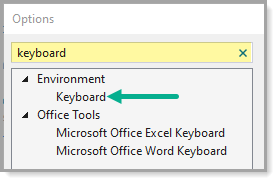
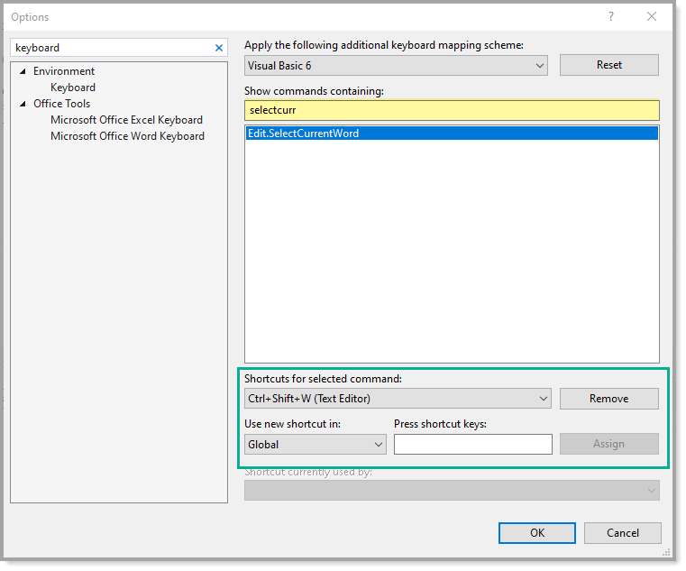

# Keyboard shortcuts

Visual Studio has several schema mappings were each have their own shortcut combinations along with some Visual Studio extensions e.g. ReSharper as shown in **figure 1**.

## Changing one or more shortcuts

Each developer on a team may have different keyboard mappings which means one developer may want to select a word using the keyboard which uses <kbd>CTRL</kbd> + <kbd>SHIFT</kbd> + <kbd>W</kbd> while another developer with a different keymapping and wants to use the same key combination.

To do this, select from Visual Studio menu `Tools`, `Options` followed by typing `keyboard` into the search input as shown in **figure 2**.

Next start typing SelectCurrentWord as shown in **figure 3**.

## Sharing or backing up keyboard shortcuts

* Select `Tool` menu
* Select `Import and Export Settings...`
* Find `keyboard` as shown in **figure 4**.
* Follow steps to complete.

For full documentation on import/export see [Microsoft documentation](https://docs.microsoft.com/en-us/visualstudio/ide/identifying-and-customizing-keyboard-shortcuts-in-visual-studio?view=vs-2019).

## Figure 1

---

## Figure 2

---

## Figure 3

---

## Figure 4

