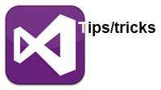

- [Task List](https://github.com/karenpayneoregon/karenpayneoregon.github.io/blob/master/visual-studio/todo.md): To track code comments that use tokens
- Get started with [using Git in Visual Studio](https://github.com/karenpayneoregon/karenpayneoregon.github.io/blob/master/UsingGit/instructions.md).
- [External Tools](https://github.com/karenpayneoregon/karenpayneoregon.github.io/blob/master/visual-studio/external-tools.md)
- Test Explorer
- [Toolbox for code snippet](https://github.com/karenpayneoregon/karenpayneoregon.github.io/blob/master/visual-studio/toolbox-code-snippet.md)
- [Solution project locations](https://github.com/karenpayneoregon/karenpayneoregon.github.io/blob/master/visual-studio/Solution-project-locations.md)

