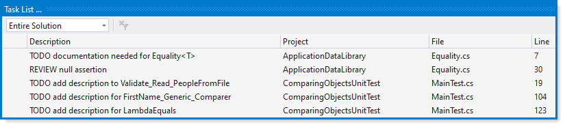
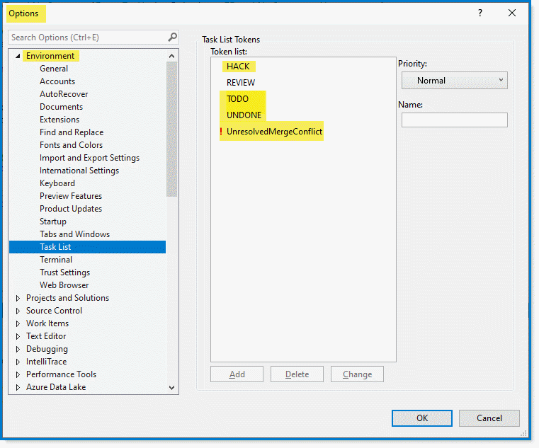
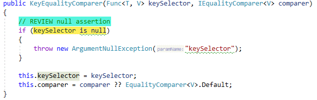

# Visual Studio tip 1

It is not uncommon for a developer to write code and not write documentation for code, notes on code that may need farther attention.

Did you know that there is a Task List built into Visual Studio? From Visual Studio `view` menu, select `Task List` or use the key combination next to the menu item e.g. <kbd>control</kbd> + <kbd>ctrl</kbd> + <kbd>alt</kbd> + <kbd>k</kbd> which presents the following dialog.

:books: [Microsoft documentation](https://docs.microsoft.com/en-us/visualstudio/ide/using-the-task-list?view=vs-2019)

 

There are several pre-defined tokens shown in highlighted text below. From Visual Studio menu select `Tools` , `Options`. New tokens can be added too as show below for `REVIEW`. 

In the case of `REVIEW`  may be from a `code review` or at the time of coding there was no time to review `iffy` code as shown in **figure 1**.

  

:bulb: To return to a item simply double click to be taken to the code.

 

## Figure 1

