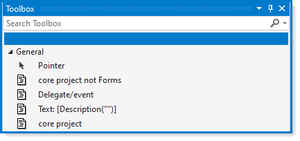

# Visual Studio Toolbox code snippets

When viewing code with the `toolbox` visible highlight code, drag-and-drop in the toolbox. Once the code has been pasted right click and rename the code.

To use the code, place the mouse cursor where to paste code, next double click on the code in the toolbox to paste into code.

If the code pasted into the toolbox is temporary, right click on the item and select delete, otherwise the text/code will remain in the toolbox for all projects until deleted or the toolbox is reset.

---

[Main page](https://github.com/karenpayneoregon/karenpayneoregon.github.io/blob/master/visual-studio/main.md)